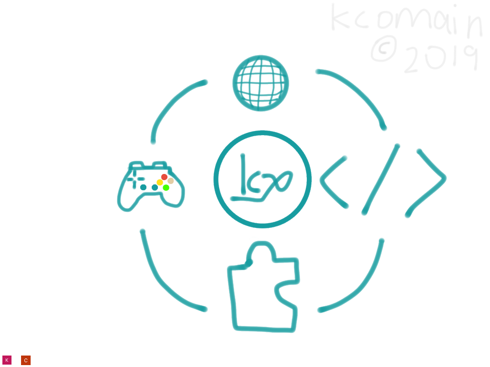

# kcomain.github.io
A web.
_HAHA_
this is my first hand created website? :ok_hand:
Yes
:innocent:
:sunny:

# Want To speak?
Join my slack at this address [Here!](https://join.slack.com/t/kcocorp-prst/shared_invite/enQtNTA1OTE0MzQzMzk3LWVhMjA3YmZmNmIwOWJlN2RhNTE1ODYxN2ZkMGRmMDQ1ZmU3YjgzMDk4OWM0NTVkNDY5OGU1ZTc2NDYzMDE2M2Q)

Or, my discord server at the image above!(Contain one nsfw channel.)
## Others...?
This page look like junk at first glance.
I am creating folders and things later on.

So, so not look at this page, it is only for people who like messy things like me XD
### Mentions
@kcomain
#### Things...
- [ ] A thing
## Things that will be stored in this website:
* JS programs
* Makecode Microbit Programs
* html things
* Misc. stuffs that i store in my computer(ITS ALL CODING STUFFS DONT WORRY)
* Project things
*So yeah!*

## News 
YAY i have updated the webpage and move all the files into "Dirs" (2018/11/21)

Erm (2018/11/22)

I am leaving this repo for a while so i decided to update the news part. (2018/11/29)

I am still making apps so please wait... (2018/12/04)

The 2019 IH Project webpage is in the development stage. More informations can be viewed on [here](https://kcomain.github.io/ihpj) (2019/01/25)

System is updating...website is kinda down, especially the main oage :joy: (2019/02/18)

System update finished, added 404 page, added robots.txt.(2019/03/01)

YO humans.txt have been added we are humans after all!(2019/02/??)

Hey pals the site image have been created.(readme.md)(2019/03/04)

WOOOOOT Brand New Items!!!!! Will Updae frequently in these few days. (2019/03/19)(Wonderful Date 19/03/19)

### Disclamer
Some codes are not provided by me.

LMAO Can't load directory.

      
LMAO Can't load directory.

      
